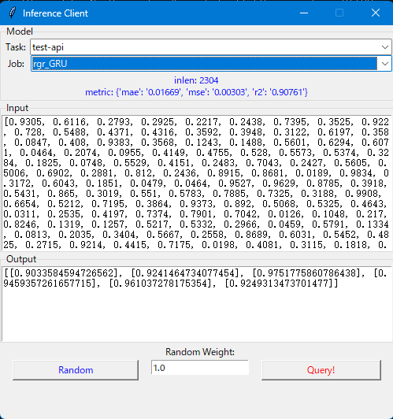

# water-quality-predict

    水质检测指标的时间序列预测平台后端

----

你妈的😠，说起来是个很简单的toy，但是差不多写了一整套批处理作业框架……  
现在变成一个平台性的作业流了：提交数据集并创建任务 -> 无脑训练若干个预测器 -> 用性能最好的预测器应对新的查询  

### Web API

Run server:

- start server `python server.py`
- point your browser to `http://127.0.0.1:5000/` to see API documentation
- env vars
  - `DEBUG_PLOT`: save intermediate plots during training for debug
  - `LOG_JOB`: log job setting & model details when loading a pretrained job

Brief API list:

- basic routine
  - `GET /task`: list up all existing tasks
  - `POST /task`: create new task (put in queue)
    - `POST /task/<name>`: retrain old task with new data
  - `GET /runtime`: see running queue, or all history
  - `GET /task/<name>`: get task results
  - `POST /infer/<task>/<job>`: predict on new data
  - `DELETE /task/<name>`: delete a task
- others
  - `GET /model`: list up models
  - `GET|POST /job/<name>`: manage your job plans
  - `GET /log/<task_name>`: download task logs
  - `GET /log/<task_name>/<job_name>`: download job logs
  - `GET /log/<task_name>/<job_name>.log`: show job log file
  - `GET /log/clean`: delete *.png plot files from disk to save space

CUI client demo:

- set env var `HOST` and `PORT`
- see API test: [server_test.py](server_test.py)

GUI client demo:

- run `python client.py -H <host> -P <port>`

### Local run

⚪ Data

- prepare your `*.csv` files (suggested to put under `data` folder)
- each file can contain several columns
  - the first columns is datetime in ISO 8601 format, e.g. `2022-09-27 18:00:00.000`
  - the rest columns are float data from your sensor devices
    - the last column is to predict on

⚪ Dataset & Train & Eval

- write a job file, see guide => [doc/job.md](doc/job.md)
- run a single job: `python run.py -D path\to\*.csv -J path\to\*.yaml --target all`
- run folder of jobs: `python run.py -D data\test.csv -X job`
  - run all test demo: `run_local.cmd`

⚪ Infer (inplace)

- run `python demo.py`

----
by Armit
2022/09/15  
2023/02/14  
2023/11/15
