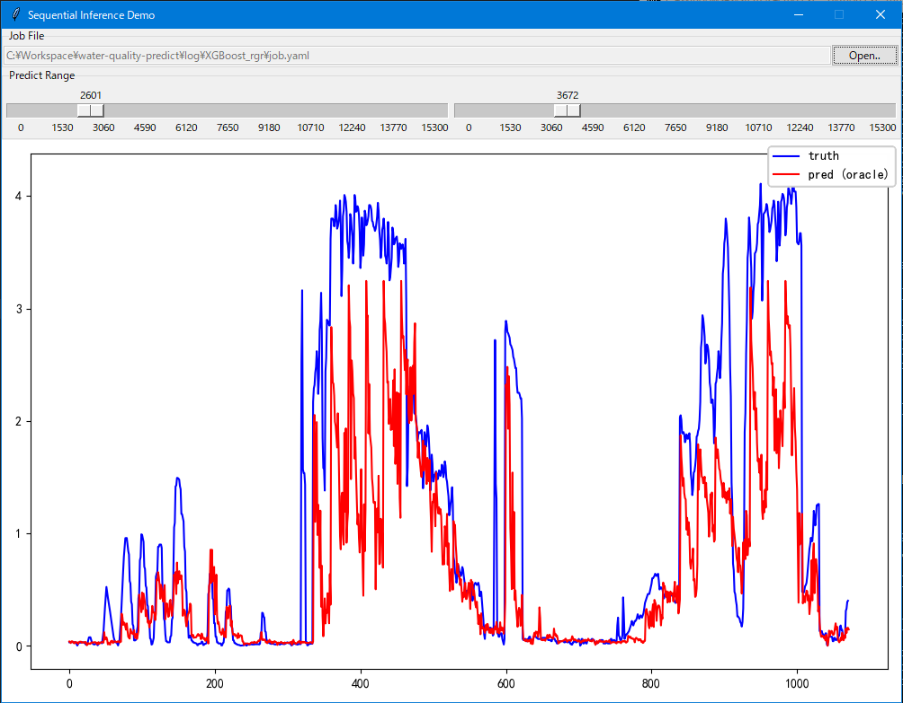

# water-quality-predict

    水质检测指标的时间序列预测

----

你妈的😠，说起来是个很简单的toy，但是差不多写了一整套批处理作业框架……  
现在变成一个平台性的作业流了：提交数据集并创建任务 -> 无脑训练若干个预测器 -> 用性能最好的预测器应对新的查询  

### Web API

- start server `python app.py`
- point your browser to `http://127.0.0.1:5000/` to see API documentation
- see client demo `python app_test.py`

### Local run

⚪ Data

- put your `*.csv` files under `data` folder
- each file can contain several columns
  - the first columns is datetime in ISO 8601 format, e.g. `2022-09-27 18:00:00.000`
  - the rest columns are float data from your sensor deivces

⚪ Dataset & Train & Eval

- write a job file, see guide => [job/README.md](job/README.md)
- run `python run.py -J path/to/*.yaml`
  - run all demo experiments: `run_experiments.cmd`

⚪ Infer

- run `python run_infer.py`

----
by Armit
2022/09/15  
2023/02/14  
